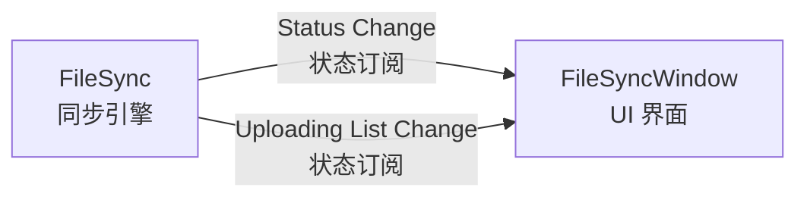

# CSM-FileSync

## 模块功能及设计

基于 Communicable-State-Machine(CSM) 的文件同步模块。CSM FileSync 模块用于将本地的数据文件备份到网络服务器中。目前支持 `文件拷贝(针对NAS)`/`FTP协议`，其他协议可以继承 Protocol.lvclass 实现拓展。

**其他特点**：

- 支持本地冗余备份
- 监控文件夹目录结构会保存到服务器
- 支持续传，程序再次启动后会继续未完成任务
- 可通过继承拓展其他协议，如 webDAV 等


## FileSync 模块接口

FileSync 是文件同步的后台引擎模块。它持续监控本地数据文件夹，将新产生的文件按原始目录结构上传到远程服务器（支持 FTP 或文件拷贝/NAS 协议）。未完成的任务会被持久化，程序重启后自动续传。FileSync 可以在无 UI 的情况下独立运行，也可配合可选的 FileSyncWindow 模块展示同步状态。

### API

| API | 描述 | 参数 | 响应 |
| --- | --- | --- | --- |
| `API: Start` | 启动文件同步服务，开始监控源文件夹并上传文件到服务器。 | N/A | N/A |
| `API: Stop` | 停止文件同步服务。 | N/A | N/A |

### 状态 (Status)

| Status | 描述 | 参数 |
| --- | --- | --- |
| `Status Change` | 同步引擎连接状态发生变化时广播。 | 状态描述字符串 |
| `Uploading List Change` | 待上传文件队列发生变化时广播。 | 待上传文件列表 |

### 配置 (Configuration)

可以通过 `CSM-FileSync.lvlib` 中的 External API VI 进行配置：

| External API VI | 描述 |
| --- | --- |
| `Config FTPSync.vi` | 配置 FTP 协议同步参数（服务器地址、账号、端口、源路径、目标路径等）。 |
| `Config LocalSync.vi` | 配置本地文件拷贝/NAS 协议同步参数（源路径、目标路径等）。 |
| `Link UI.vi` | 将 FileSyncWindow 界面模块链接到 FileSync 同步引擎。 |
| `Exit Module.vi` | 退出 FileSync 模块。 |

**示例：（假设模块名称为 "FileSync"）**

```csm
API: Start -> FileSync
API: Stop -> FileSync
```

## FileSyncWindow 模块接口

FileSyncWindow 是 FileSync 的可选 UI 模块，用于展示文件同步的实时状态。

### API

| API | 描述 | 参数 | 响应 |
| --- | --- | --- | --- |
| `API: Link to Sync Engine` | 将 FileSyncWindow 链接到指定的 FileSync 引擎，建立状态订阅关系。 | FileSync 模块名称 <br/> (类型: 普通字符串) | N/A |
| `API: Update List` | 更新界面中的待上传文件列表显示。 | 待上传文件列表 | N/A |
| `API: Update Connected Status` | 更新界面中的服务器连接状态显示。 | 状态描述字符串 | N/A |
| `API: Update Statusbar` | 更新界面底部状态栏信息。 | 状态栏文本 | N/A |

## FileSync 与 FileSyncWindow 的关系

FileSync 和 FileSyncWindow 是两个独立的 CSM 模块，采用松耦合设计：

- **FileSync** 是文件同步的后台引擎，负责实际的文件监控、队列管理和上传操作，可以在无 UI 的情况下独立运行。
- **FileSyncWindow** 是可选的 UI 展示模块，用于将 FileSync 的工作状态以界面形式呈现给用户。

两者通过 CSM 的状态订阅机制连接：调用 `Link UI.vi`（或 `API: Link to Sync Engine`）后，FileSyncWindow 会自动订阅 FileSync 发布的 `Status Change` 和 `Uploading List Change` 状态，并实时更新界面显示。



这种设计使得 FileSync 可以在不依赖任何 UI 的情况下嵌入其他应用，而 FileSyncWindow 只需通过一次 `Link UI` 调用即可接入任意 FileSync 实例。

## 下载使用

- 开发版本： LabVIEW 2020
- VIPM 依赖：
  - CSM Framework v2025.May 起
  - MGI
  - Hooovahh Array VIMs v3.1.1.22 by Hooovahh

## 模块展示 & 使用截图


- 可以使用 CSM-FileSync.lvlib 中的 External API 调用模块
- 使用源码的情况下，可以使用 CSM API调用
- (可选) 可以将同步的状态显示到 FileSyncWindow 界面
- (拓展）如果目前的协议不能满足备份需求，仿照 FTPProtocol.lvclass, 添加新的备份协议，即可支持其他协议。欢迎有兴趣的开发者提交 PR 到该仓库扩展新的协议，如 WebDAV 等.

## 开源说明

本项目以 MIT 开源许可证（MIT License）发布，具体授权条款及免责声明请参见 [LICENSE](LICENSE) 文件。
